# Boss 战技能设计文档

---

## 设计思路

**核心定位**：武侠风格 10 人副本 Boss，强调团队走位与机制执行。

**整体思路**：

一阶段让团队熟悉机制，Boss 硬直窗口多，容错宽松，重点在建立配合意识；二阶段多机制并发，硬直窗口减少，考验团队在高压下的稳定执行。

每个技能围绕「读懂机制 → 做对 → 获得回报」的正向循环设计，失误有容错空间，不同职责各有分工，避免有人闲着当观众。

整体节奏从轻松到紧张，让玩家在反复尝试中逐步掌握节奏，最终通关时有明显的成就感。

---

## 一阶段

### 太祖长拳 · 招式1

> Boss 快速位移至玩家右侧，短暂引导后以自身为原点释放圆形 AOE 伤害。

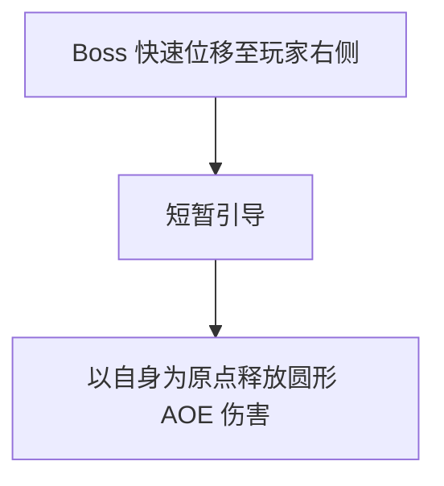

**内容**：Boss 以极快的速度突进到目标玩家右侧，停留约 0.8 秒进行蓄力引导，随后以自身为圆心释放中等半径的圆形真气冲击波。该招式起手快、前摇短，是 Boss 最基础的近身压迫技。

**应对方法**：看到 Boss 突进后立即向远离 Boss 的方向翻滚脱离 AOE 范围；承伤位可利用此招的前摇窗口打出一轮爆发输出后及时后撤。

**乐趣**：突进瞬间的压迫感+翻滚躲开的"好险"感，反复出现帮助建立肌肉记忆。

---

### 太祖长拳 · 招式2

> Boss 快速位移至玩家左侧，释放连续三段伤害，释放完毕后进入硬直。

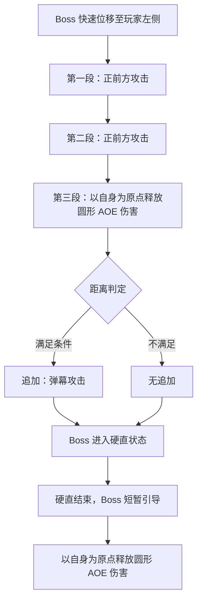

**内容**：Boss 突进至玩家左侧，连续挥出两段正面拳击，第三段转为以自身为圆心的圆形 AOE。若第三段命中时玩家距离过远（超出圆形 AOE 范围），Boss 会追加一道远程冲击波攻击；若玩家在 AOE 范围内则无追加。无论是否追加，三段攻击结束后 Boss 进入硬直。硬直恢复后 Boss 会再接一个圆形 AOE 作为收招，形成"连打-硬直-收招"的完整节奏。

**应对方法**：前两段正面攻击通过侧向翻滚躲避；第三段圆形 AOE 时需拉开距离但不可过远，刚好脱离 AOE 范围即可，躲得过远会触发远程冲击波追加；硬直窗口是最佳输出时机，全队集中火力打一轮爆发；硬直恢复后的收招 AOE 仍需及时脱离。

**乐趣**：三拳节奏感强，撑过去后 Boss 进入硬直，全队获得充足的输出窗口；躲 AOE 时需要控制距离，躲得太远反而吃冲击波，在"安全撤离"和"过度远离"之间把握分寸。

---

### 真气逆流 · 招式1

> Boss 召唤一颗真气大球并引导其蓄力爆炸，玩家需集火攻击。

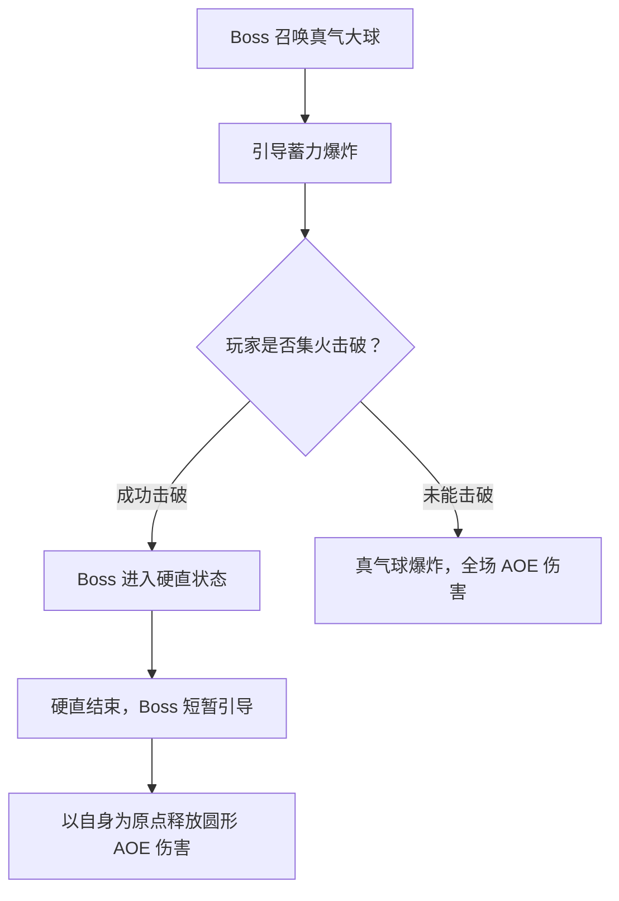

**内容**：Boss 在场地中央召唤一颗大型真气球，真气球拥有独立的血量条并持续蓄力（约 10 秒）。蓄力期间 Boss 自身不会攻击，但真气球会逐渐变红发出脉动作为视觉提示。若玩家在蓄力结束前集火击破真气球，Boss 因反噬进入约 8 秒的硬直；若未能击破，真气球爆炸造成全场高额 AOE，之后 Boss 仍会释放一个圆形 AOE 收招。

**应对方法**：真气球出现后全队立即转火集火，输出位使用高伤害技能全力攻击；治疗位可辅助输出；承伤位站位靠前吸引 Boss 注意避免其干扰输出。击破后利用硬直窗口最大化输出。若伤害不足未能击破，治疗需提前准备群体治疗应对全场 AOE。

**乐趣**：纯粹的伤害检验，球体颜色从蓝变红营造紧迫感，集火击破后获得硬直窗口，反馈直接明确。

---

### 真气逆流 · 招式2

> Boss 召唤 3 颗小球，不攻击则定期释放冲击波，玩家需集中攻击一颗。

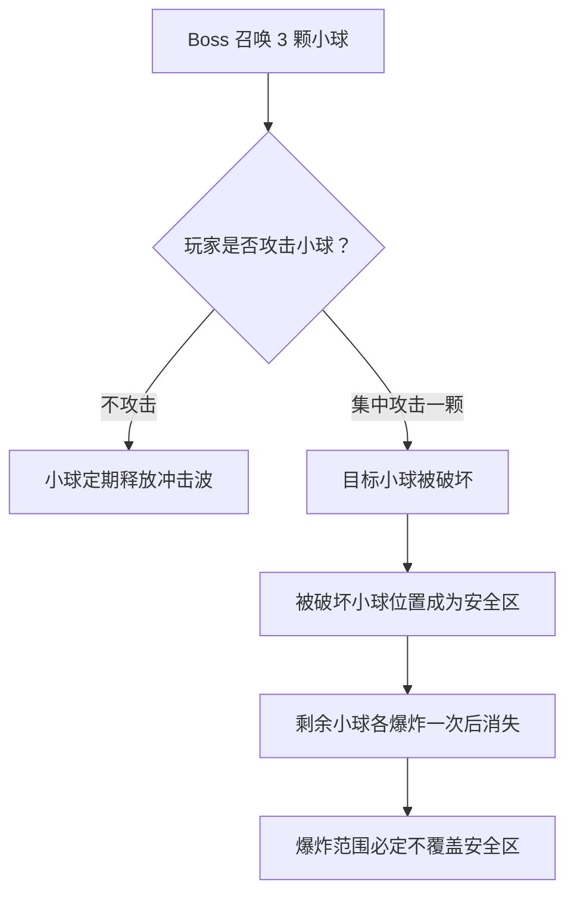

**内容**：Boss 在场地中召唤 3 颗小型真气球，呈三角形分布。若不攻击，3 颗小球会定期释放覆盖全场的小范围冲击波，持续对玩家造成骚扰伤害。玩家需选择其中一颗集中攻击将其破坏，被破坏的小球位置会形成一个安全区（金色光罩标记），随后剩余两颗小球各爆炸一次后消失，爆炸范围必定不覆盖安全区。

**应对方法**：全队迅速沟通选定同一颗小球集火攻击；破坏后全队移动至安全区等待剩余小球爆炸；治疗位在小球未被破坏期间保持团队血量，应对冲击波的骚扰伤害。

**乐趣**：全队需要快速统一目标，语音沟通中建立默契；击破后出现的安全区在混乱中提供明确的避险点。

---

### 定身术

> Boss 点名玩家读条，读条结束后被点名玩家被结界定身。

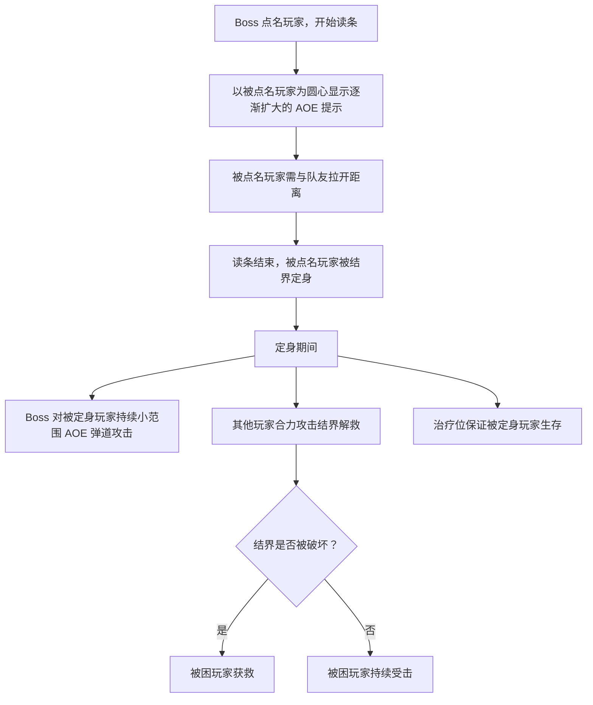

**点名规则**：首次使用固定点名承伤位玩家；之后随机点名两名玩家。

**内容**：Boss 以真气锁定点名玩家，开始约 3 秒的读条。读条期间以被点名玩家为圆心显示逐渐扩大的红色 AOE 提示圈，提示圈内其他队友也会受伤，因此被点名玩家需主动与队友拉开距离。读条结束后被点名玩家被结界包裹定身，无法移动和使用技能。定身期间 Boss 会对被困玩家持续发射小范围弹道攻击，其他玩家需合力攻击结界（结界有独立血量条）将其破坏解救队友，同时治疗位需持续保证被困玩家生存。

**应对方法**：被点名玩家看到点名标记后立即远离队友，避免 AOE 提示圈波及他人；其余输出位第一时间转火攻击结界；治疗位专注治疗被困玩家，保证其在解救前不会死亡；首次固定点名承伤位是为了教学，让玩家知道这个机制的解法。

**乐趣**：队友被困后全队合力破局，打破结界时的成就感强烈；不同职责各有分工，参与感均衡。

---

### 漂浮术

> Boss 点名玩家使其浮空，其他玩家需在下方接住。

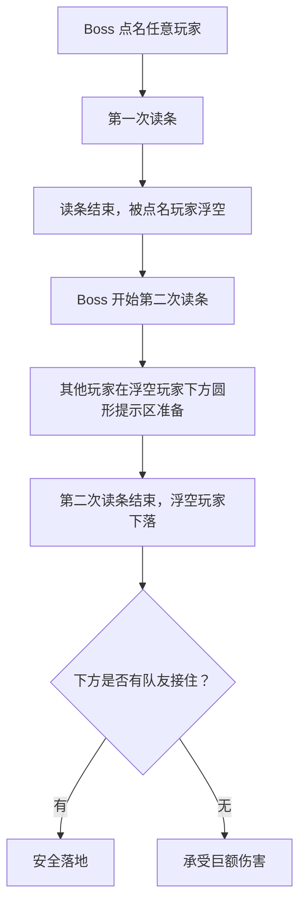

**内容**：Boss 点名一名玩家，进行第一次读条（约 2 秒），读条结束后被点名玩家被真气托举浮空，失去移动能力。随后 Boss 开始第二次读条（约 3 秒），同时在浮空玩家正下方显示一个圆形接人提示区。第二次读条结束后浮空玩家快速下落，若下方有队友站在提示区内则安全接住，否则承受巨额坠落伤害。

**应对方法**：被点名玩家无需特殊操作，只需注意浮空后不要惊慌；其他玩家在第二次读条期间移动到浮空玩家正下方的圆形提示区等待接人；接人后短暂减速但不会受伤，接人玩家需确保自身站位安全。

**乐趣**：接住队友时的协作满足感；两次读条给予充足反应时间，机制简单但互动性强。

---

## 二阶段

### 太祖长拳 · 招式1

> Boss 连续向前释放两段斩击，随后投掷长矛。

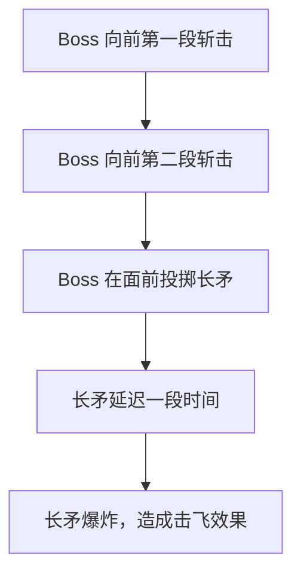

**内容**：二阶段太祖长拳的升级版。Boss 向正面连续释放两段直线斩击，每段覆盖前方扇形区域，之后在面前投掷一柄真气长矛。长矛落地后停留约 1.5 秒，随后爆炸造成范围伤害并附带击飞效果。相比一阶段，增加了延迟爆炸元素，攻击范围更大。

**应对方法**：两段斩击通过侧翻躲避；长矛落地后注意地面标记，在爆炸前离开范围；被击飞后需迅速起身调整站位，避免在浮空状态吃后续伤害。承伤位尽量站在 Boss 正面吃斩击，引导长矛投在安全位置。

**乐趣**：躲完斩击后还需应对延迟爆炸的长矛，紧张感层层递进；被击飞后阵型打乱，后续走位更具挑战。

---

### 太祖长拳 · 招式2

> Boss 向前方依次挥出两拳，并发出冲击波。

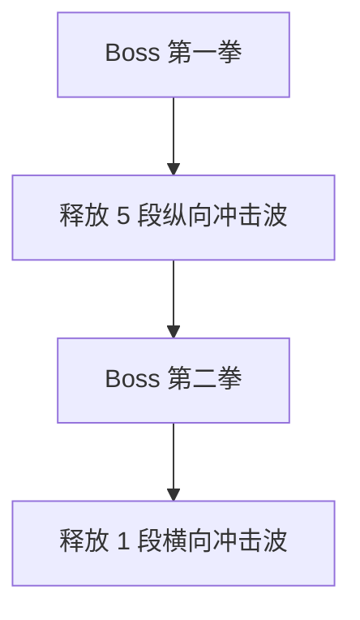

**内容**：Boss 向前方挥出第一拳，释放 5 段纵向（从近到远）冲击波，覆盖正面大片区域；随后挥出第二拳，释放 1 段横向冲击波，覆盖 Boss 身前近处的横扫范围。纵横向冲击波形成十字形攻击区域，玩家需在两次攻击的间隙找到安全位置。

**应对方法**：第一拳后纵向冲击波之间有狭窄间隙，走位好的玩家可以穿插闪避；更稳妥的策略是移动到 Boss 侧面/背面脱离纵向范围；第二拳的横向冲击波需跳跃或向后翻滚躲避。切忌站在 Boss 正面贪输出。

**乐趣**：5 段纵向冲击波形成视觉上的"弹幕"效果，在狭窄间隙中穿梭的成就感；横纵向组合攻击考验空间感知能力。

---

### 真气逆流 · 招式1

> Boss 召唤 10 颗小球，玩家需集中攻击一颗。

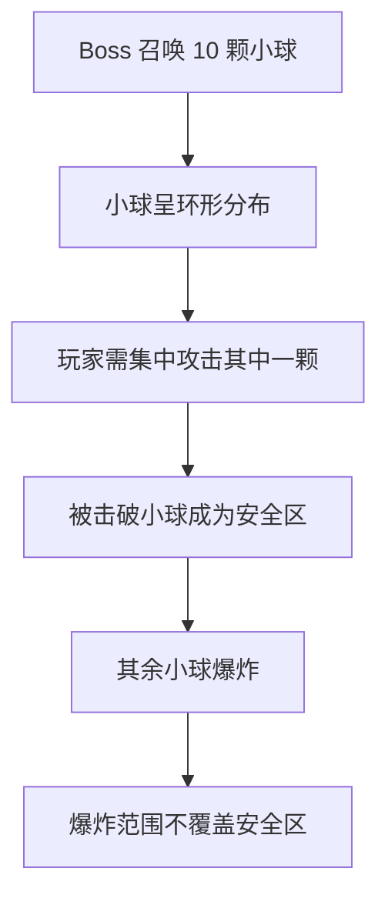

**内容**：Boss 在场地中召唤 10 颗小型真气球，呈环形分布。这些小球会定期释放覆盖全场的冲击波，玩家需选择其中一颗集中攻击将其破坏，被破坏的小球位置会形成一个安全区，随后剩余小球各爆炸一次后消失，爆炸范围必定不覆盖安全区。

**应对方法**：全队迅速沟通选定同一颗小球集火攻击；破坏后全队移动至安全区等待剩余小球爆炸；治疗位在小球未被破坏期间保持团队血量。

**乐趣**：相比一阶段的 3 颗球，10 颗球增加了沟通难度和紧迫感；安全区在环形爆炸中提供明确的避险点。

---

### 真气逆流 · 招式2

> Boss 召唤 2 颗大球，玩家需同时击破。

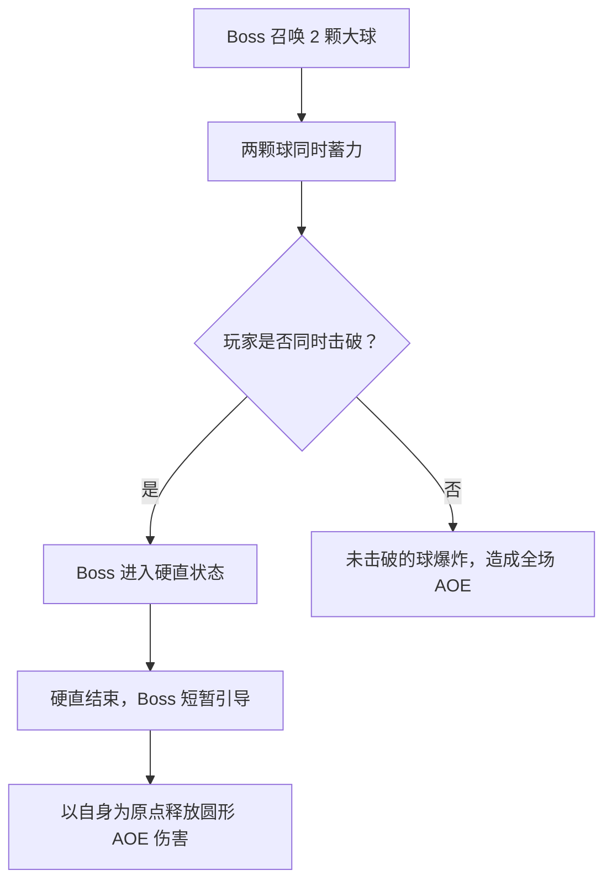

**内容**：Boss 在场地中召唤 2 颗大型真气球，两颗球同时蓄力（约 8 秒）。玩家需要在蓄力结束前同时击破两颗球（血量差不能超过 20%），若成功则 Boss 因反噬进入硬直；若只击破一颗，另一颗会爆炸造成全场高额 AOE。

**应对方法**：输出位需要合理分配火力，确保两颗球血量接近；当一颗球血量较低时，部分输出位需要转火另一颗；治疗位需准备群体治疗应对可能的爆炸伤害。

**乐趣**：考验团队的火力分配和沟通能力，两颗球血量接近时的紧张感；同时击破后的成就感强烈。

---

### 定身术 · 升级版

> Boss 点名两名玩家读条，读条结束后被点名玩家被结界定身。

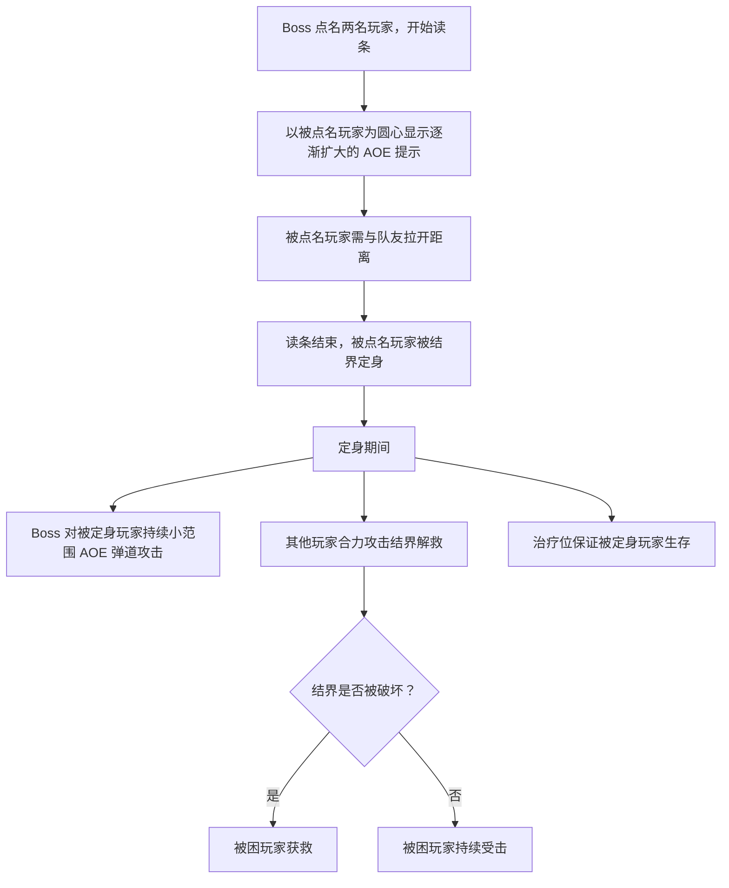

**点名规则**：随机点名两名玩家。

**内容**：与一阶段类似，但同时点名两名玩家。两名被点名玩家需要分别远离队友和彼此，避免 AOE 提示圈重叠。定身期间 Boss 会对两名被困玩家持续发射小范围弹道攻击，其他玩家需合力攻击结界将其解救。

**应对方法**：两名被点名玩家需要向不同方向远离队友，避免 AOE 提示圈重叠；其余输出位需要分两组分别攻击两个结界；治疗位需要同时关注两名被困玩家的血量。

**乐趣**：相比一阶段，同时处理两个结界增加了紧张感和沟通难度；分兵解救的策略选择增加了战术深度。

---

### 漂浮术 · 升级版

> Boss 点名两名玩家使其浮空，其他玩家需在下方接住。

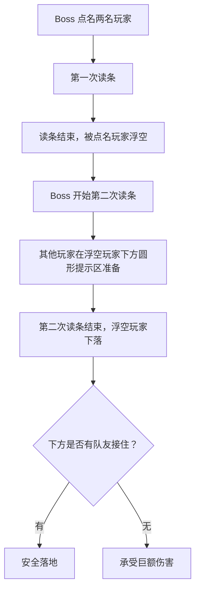

**内容**：与一阶段类似，但同时点名两名玩家。两名被点名玩家需要被接住，接人玩家需要合理分配，确保两名浮空玩家都能被接住。

**应对方法**：接人玩家需要快速移动到两名浮空玩家正下方的圆形提示区等待接人；如果接人玩家不足，优先接住距离较远的玩家；接人后短暂减速但不会受伤。

**乐趣**：同时处理两个浮空玩家的紧张感；接人玩家之间的分工协作。

---

## 总结

**整体节奏**：

一阶段：太祖长拳招式1 → 招式2 → 真气逆流招式1 → 招式2 → 定身术 → 漂浮术 → 循环

二阶段：太祖长拳招式1 → 招式2 → 真气逆流招式1 → 招式2 → 定身术升级版 → 漂浮术升级版 → 循环

**设计要点**：

- 每个技能都有明确的"读懂机制 → 做对 → 获得回报"循环
- 失误有容错空间，不会一击必杀
- 不同职责各有分工，避免有人闲着
- 整体节奏从轻松到紧张，让玩家逐步掌握
- 机制之间有合理的间隔，给玩家喘息时间
- 二阶段在一阶段基础上升级，考验团队在高压下的稳定执行
