# Boss 战技能设计文档

---

## 设计思路

**核心定位**：武侠风格 10 人副本 Boss，强调团队走位与机制执行。

**整体思路**：

一阶段让团队熟悉机制，Boss 硬直窗口多，容错宽松，重点在建立配合意识；二阶段多机制并发，硬直窗口减少，考验团队在高压下的稳定执行。

每个技能围绕「读懂机制 → 做对 → 获得回报」的正向循环设计，失误有容错空间，不同职责各有分工，避免有人闲着当观众。

整体节奏从轻松到紧张，让玩家在反复尝试中逐步掌握节奏，最终通关时有明显的成就感。

---

## 一阶段

### 太祖长拳 · 招式1

> Boss 快速位移至玩家右侧，短暂引导后以自身为原点释放圆形 AOE 伤害。

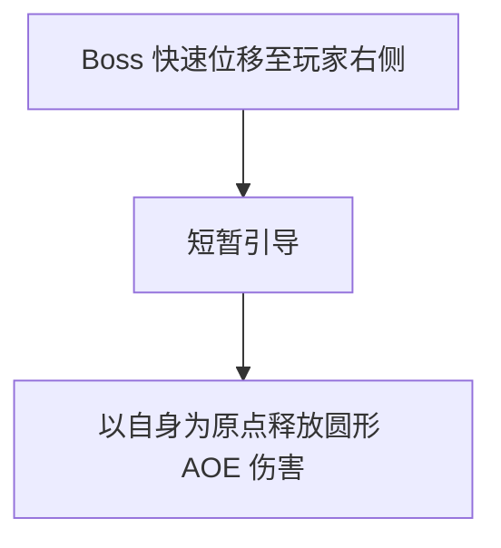

**内容**：Boss 以极快的速度突进到目标玩家右侧，停留约 0.8 秒进行蓄力引导，随后以自身为圆心释放中等半径的圆形真气冲击波。该招式起手快、前摇短，是 Boss 最基础的近身压迫技。

**应对方法**：看到 Boss 突进后立即向远离 Boss 的方向翻滚脱离 AOE 范围；承伤位可利用此招的前摇窗口打出一轮爆发输出后及时后撤。

**乐趣**：突进瞬间的压迫感+翻滚躲开的"好险"感，反复出现帮助建立肌肉记忆。

---

### 太祖长拳 · 招式2

> Boss 快速位移至玩家左侧，释放连续三段伤害，释放完毕后进入硬直。

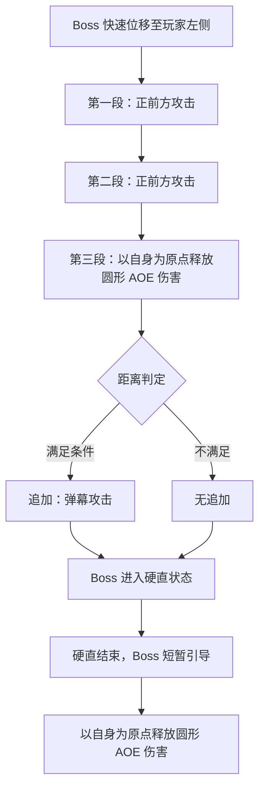

**内容**：Boss 突进至玩家左侧，连续挥出两段正面拳击，第三段转为以自身为圆心的圆形 AOE。若第三段命中时玩家距离过远（超出圆形 AOE 范围），Boss 会追加一道远程冲击波攻击；若玩家在 AOE 范围内则无追加。无论是否追加，三段攻击结束后 Boss 进入硬直。硬直恢复后 Boss 会再接一个圆形 AOE 作为收招，形成"连打-硬直-收招"的完整节奏。

**应对方法**：前两段正面攻击通过侧向翻滚躲避；第三段圆形 AOE 时需拉开距离但不可过远，刚好脱离 AOE 范围即可，躲得过远会触发远程冲击波追加；硬直窗口是最佳输出时机，全队集中火力打一轮爆发；硬直恢复后的收招 AOE 仍需及时脱离。

**乐趣**：三拳节奏感强，撑过去后 Boss 进入硬直，全队获得充足的输出窗口；躲 AOE 时需要控制距离，躲得太远反而吃冲击波，在"安全撤离"和"过度远离"之间把握分寸。

---

### 真气逆流 · 招式1

> Boss 召唤一颗真气大球并引导其蓄力爆炸，玩家需集火攻击。

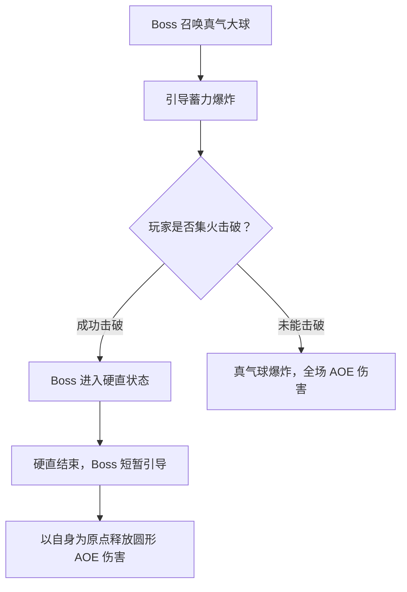

**内容**：Boss 在场地中央召唤一颗大型真气球，真气球拥有独立的血量条并持续蓄力（约 10 秒）。蓄力期间 Boss 自身不会攻击，但真气球会逐渐变红发出脉动作为视觉提示。若玩家在蓄力结束前集火击破真气球，Boss 因反噬进入约 8 秒的硬直；若未能击破，真气球爆炸造成全场高额 AOE，之后 Boss 仍会释放一个圆形 AOE 收招。

**应对方法**：真气球出现后全队立即转火集火，输出位使用高伤害技能全力攻击；治疗位可辅助输出；承伤位站位靠前吸引 Boss 注意避免其干扰输出。击破后利用硬直窗口最大化输出。若伤害不足未能击破，治疗需提前准备群体治疗应对全场 AOE。

**乐趣**：纯粹的伤害检验，球体颜色从蓝变红营造紧迫感，集火击破后获得硬直窗口，反馈直接明确。

---

### 真气逆流 · 招式2

> Boss 召唤 3 颗小球，不攻击则定期释放冲击波，玩家需集中攻击一颗。

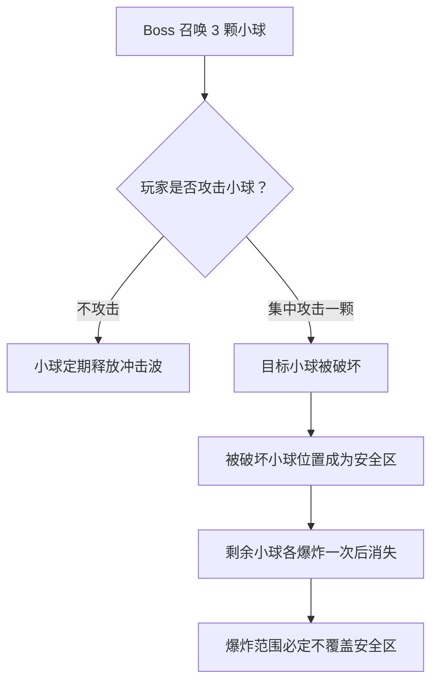

**内容**：Boss 在场地中召唤 3 颗小型真气球，呈三角形分布。若不攻击，3 颗小球会定期释放覆盖全场的小范围冲击波，持续对玩家造成骚扰伤害。玩家需选择其中一颗集中攻击将其破坏，被破坏的小球位置会形成一个安全区（金色光罩标记），随后剩余两颗小球各爆炸一次后消失，爆炸范围必定不覆盖安全区。

**应对方法**：全队迅速沟通选定同一颗小球集火攻击；破坏后全队移动至安全区等待剩余小球爆炸；治疗位在小球未被破坏期间保持团队血量，应对冲击波的骚扰伤害。

**乐趣**：全队需要快速统一目标，语音沟通中建立默契；击破后出现的安全区在混乱中提供明确的避险点。

---

### 定身术

> Boss 点名玩家读条，读条结束后被点名玩家被结界定身。

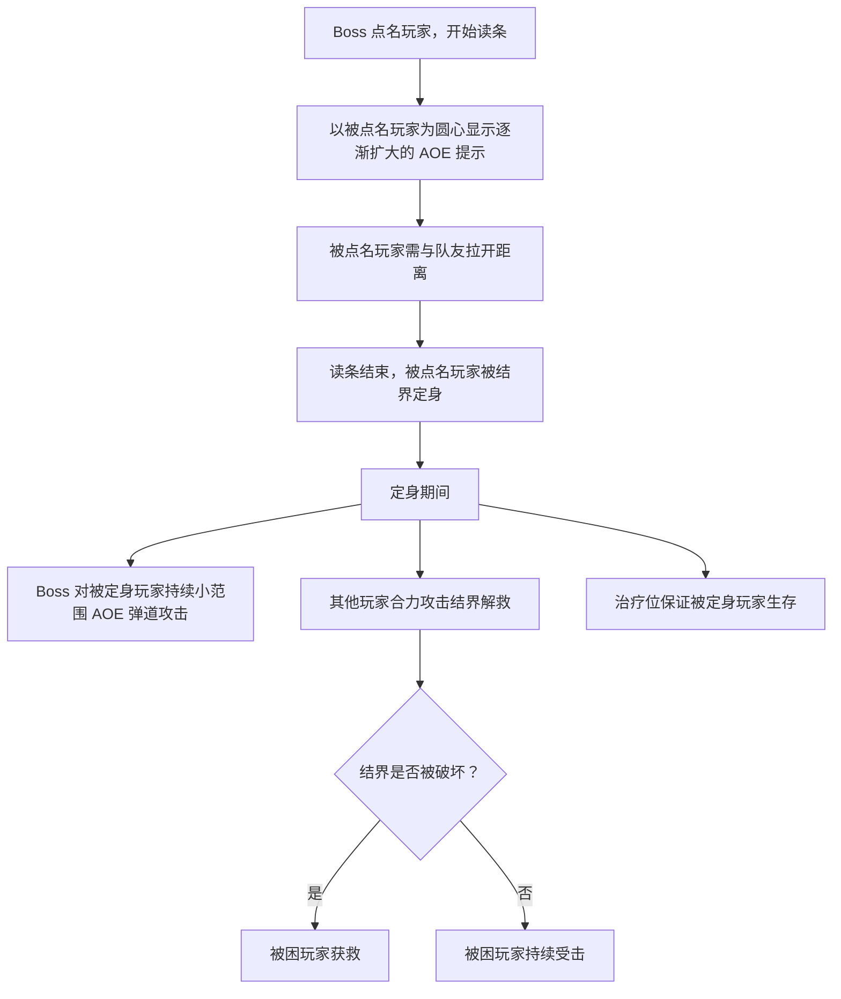

**点名规则**：首次使用固定点名承伤位玩家；之后随机点名两名玩家。

**内容**：Boss 以真气锁定点名玩家，开始约 3 秒的读条。读条期间以被点名玩家为圆心显示逐渐扩大的红色 AOE 提示圈，提示圈内其他队友也会受伤，因此被点名玩家需主动与队友拉开距离。读条结束后被点名玩家被结界包裹定身，无法移动和使用技能。定身期间 Boss 会对被困玩家持续发射小范围弹道攻击，其他玩家需合力攻击结界（结界有独立血量条）将其破坏解救队友，同时治疗位需持续保证被困玩家生存。

**应对方法**：被点名玩家看到点名标记后立即远离队友，避免 AOE 提示圈波及他人；其余输出位第一时间转火攻击结界；治疗位专注治疗被困玩家，保证其在解救前不会死亡；首次固定点名承伤位是为了教学，让玩家知道这个机制的解法。

**乐趣**：队友被困后全队合力破局，打破结界时的成就感强烈；不同职责各有分工，参与感均衡。

---

### 漂浮术

> Boss 点名玩家使其浮空，其他玩家需在下方接住。

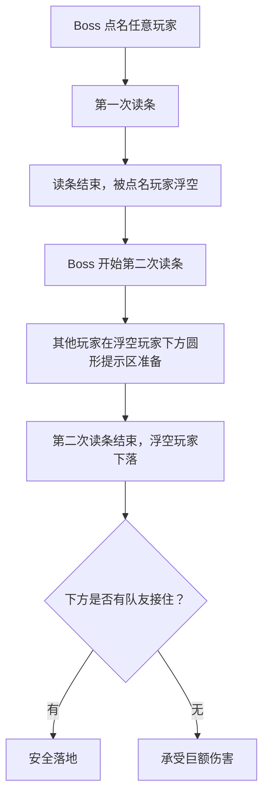

**内容**：Boss 点名一名玩家，进行第一次读条（约 2 秒），读条结束后被点名玩家被真气托举浮空，失去移动能力。随后 Boss 开始第二次读条（约 3 秒），同时在浮空玩家正下方显示一个圆形接人提示区。第二次读条结束后浮空玩家快速下落，若下方有队友站在提示区内则安全接住，否则承受巨额坠落伤害。

**应对方法**：被点名玩家无需特殊操作，只需注意浮空后不要惊慌；其他玩家在第二次读条期间移动到浮空玩家正下方的圆形提示区等待接人；接人后短暂减速但不会受伤，接人玩家需确保自身站位安全。

**乐趣**：接住队友时的协作满足感；两次读条给予充足反应时间，机制简单但互动性强。

---

## 二阶段

### 太祖长拳 · 招式1

> Boss 连续向前释放两段斩击，随后投掷长矛。

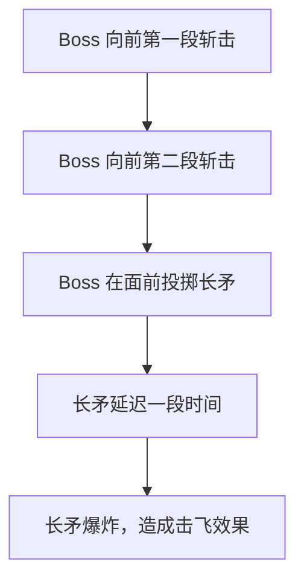

**内容**：二阶段太祖长拳的升级版。Boss 向正面连续释放两段直线斩击，每段覆盖前方扇形区域，之后在面前投掷一柄真气长矛。长矛落地后停留约 1.5 秒，随后爆炸造成范围伤害并附带击飞效果。相比一阶段，增加了延迟爆炸元素，攻击范围更大。

**应对方法**：两段斩击通过侧翻躲避；长矛落地后注意地面标记，在爆炸前离开范围；被击飞后需迅速起身调整站位，避免在浮空状态吃后续伤害。承伤位尽量站在 Boss 正面吃斩击，引导长矛投在安全位置。

**乐趣**：躲完斩击后还需应对延迟爆炸的长矛，紧张感层层递进；被击飞后阵型打乱，后续走位更具挑战。

---

### 太祖长拳 · 招式2

> Boss 向前方依次挥出两拳，并发出冲击波。

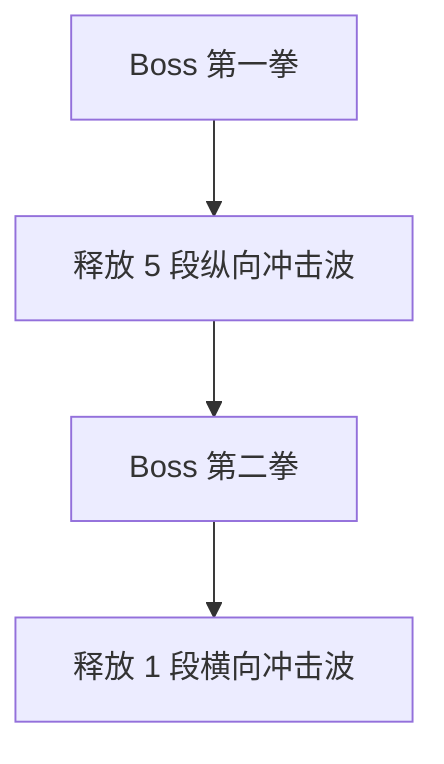

**内容**：Boss 向前方挥出第一拳，释放 5 段纵向（从近到远）冲击波，覆盖正面大片区域；随后挥出第二拳，释放 1 段横向冲击波，覆盖 Boss 身前近处的横扫范围。纵横向冲击波形成十字形攻击区域，玩家需在两次攻击的间隙找到安全位置。

**应对方法**：第一拳后纵向冲击波之间有狭窄间隙，走位好的玩家可以穿插闪避；更稳妥的策略是移动到 Boss 侧面/背面脱离纵向范围；第二拳的横向冲击波需跳跃或向后翻滚躲避。切忌站在 Boss 正面贪输出。

**乐趣**：纵向冲击波之间的狭窄缝隙为走位熟练的玩家提供穿插空间；纵横向攻击交替出现，需要快速判断安全位置。

---

### 真气逆流

> Boss 召唤四颗小球分布于场地四方，持续向中心释放冲击波，玩家需识别并集火特殊目标。

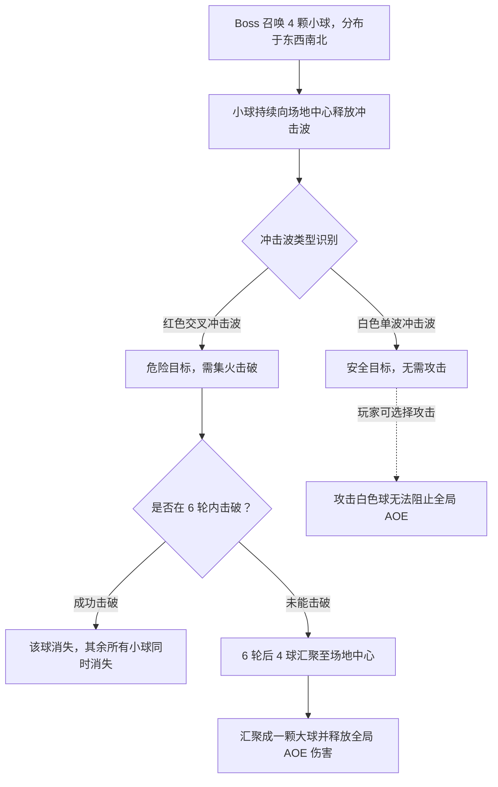

**内容**：Boss 在场地东西南北四个方向各召唤一颗真气小球，四颗球持续向场地中心释放冲击波。其中一颗释放红色交叉冲击波（两道交叉扩散），其余三颗释放白色单波冲击波（单道扩散）。红色交叉冲击波覆盖范围更大、伤害更高，是真正的威胁目标。玩家需在 6 轮冲击波周期内识别并集火击破释放红色交叉冲击波的小球。若成功击破，该球消失，其余所有小球同时消失，机制结束；若 6 轮后仍未击破，四颗球同时向场地中心汇聚，合并成一颗大球并释放全局高额 AOE。玩家也可以选择攻击白色小球，但无法阻止最终的全局 AOE。

**应对方法**：小球出现后快速观察冲击波颜色，找到释放红色交叉冲击波的目标；全队集中火力攻击该球，忽略其他三颗白色球；承伤位将 Boss 拉至远离红色球的位置，避免近战输出被冲击波干扰；治疗位注意团队在躲避冲击波期间的血量；若团队输出不足，需提前准备减伤技能应对 6 轮后的全局 AOE。

**乐趣**：从"选一个打"升级为"识别目标再打"，观察判断成为第一步；红色交叉冲击波的视觉差异清晰，找到目标时有"发现了"的顿悟感；6 轮倒计时制造持续压力，击破后所有球同时消失的反馈干净利落。

---

### 打狗棍法 · 招式1（内外圈）

> Boss 先内圈再外圈交替伤害，玩家需内外切换躲避。

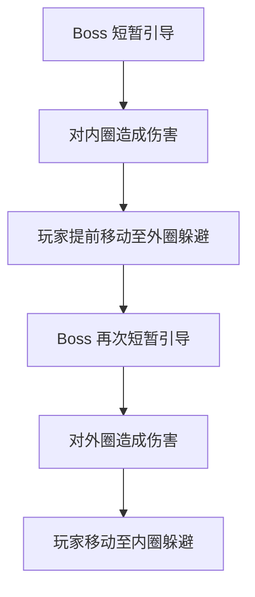

**内容**：Boss 举起棍棒短暂引导（约 1 秒），先对以自身为圆心的内圈（近处）造成伤害，外圈安全；随后再次引导，对外圈（远处）造成伤害，内圈安全。内外圈交替进行，通常 2-3 轮。玩家需要在内圈攻击时跑到外圈，外圈攻击时跑回内圈，像钟摆一样在 Boss 周围来回移动。

**应对方法**：观察 Boss 引导动画判断下一击方向（内圈/外圈），提前移动；内圈攻击时向外跑，外圈攻击时向内跑；承伤位可站在内外圈交界处减少跑动距离；治疗位注意跑动中队友可能被蹭伤，保持血线。

**乐趣**：内外圈交替跑动形成独特的节奏感，熟练后动作流畅如舞蹈；从初期的慌乱到后期的从容，进步感明显。

---

### 打狗棍法 · 招式2（正前方）

> Boss 对正前方引导，释放矩形范围伤害。

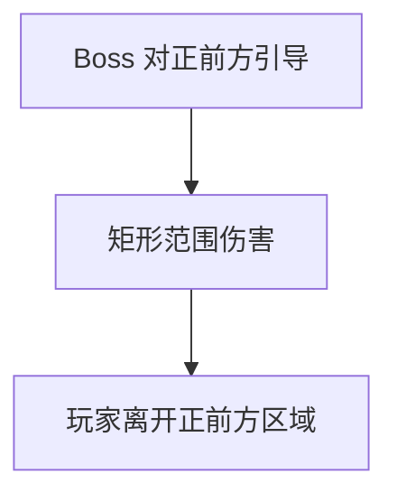

**内容**：Boss 将棍棒举过头顶短暂引导，对正前方释放一道矩形范围伤害，覆盖宽度约 120 度扇形区域，纵深延伸至场地边缘。该招式简单直接，但伤害高、范围大，作为其他机制的间隙插入，打断玩家的输出节奏。

**应对方法**：看到引导动画后立即移动到 Boss 侧面或背面；承伤位可利用无敌帧硬抗后继续拉仇恨；该招前摇明显，熟练后可以"贴边"输出，只在最后一刻侧闪。

**乐趣**：简单直接的正面攻击，为复杂机制之间提供节奏缓冲；熟练后可在安全边缘极限输出，为进阶玩家提供操作空间。

---

### 神龙摆尾 + 擒龙手 + 降龙十八掌

> Boss 将玩家击退至边缘，禁用技能与位移，持续召唤带缺口的冲击波，同时点名玩家施加威压。

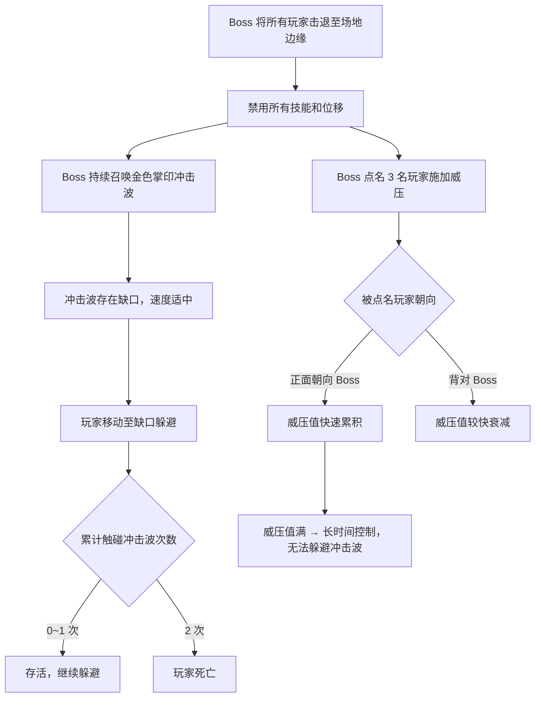

**内容**：这是二阶段的核心复合机制，同时施加三个维度压力。开场 Boss 以神龙摆尾将所有玩家击退至场地边缘，随后以擒龙手禁用所有玩家的技能和位移（持续约 15 秒），在此期间 Boss 持续召唤金色掌印冲击波从自身向外扩散，冲击波存在缺口，速度适中，玩家只能通过移动躲避（无法翻滚）。同时 Boss 点名 3 名玩家施加威压，被点名玩家正面朝向 Boss 时威压值快速累积，满值后进入长时间控制状态（期间无法移动躲避冲击波），背对 Boss 则威压值较快衰减。

**应对方法**：被击退后快速冷静，确认自身位置；禁用期间只能走路不能翻滚和放技能，因此走位精度要求更高；观察冲击波缺口方向，提前移动对齐缺口通过；被点名威压的玩家必须背对 Boss，通过声音判断冲击波节奏侧向移动；未被点名威压的玩家可正常面向 Boss 观察冲击波；触碰冲击波容错 1 次，第 2 次才死亡，给玩家修正空间。

**乐趣**：禁用技能和位移后回归基础走位，带来不同于常规战斗的体验；威压机制要求背对 Boss 同时躲避冲击波，制造认知冲突；从混乱到掌握节奏的过程极具成就感，是整场战斗的核心记忆点。

---

### 亢龙有悔

> Boss 点名标记玩家并召唤能量球，击破后生成护罩，被标记玩家需进入护罩躲避必杀；未能击破则被标记玩家直接死亡。

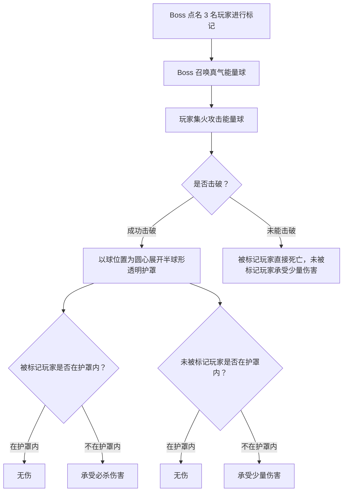

**内容**：Boss 点名 3 名玩家施加红色标记，随后在场地中召唤一颗真气能量球。能量球有独立血量条，玩家需在约 10 秒内将其击破。击破后以球的位置为圆心展开一个半球形透明护罩，护罩持续约 5 秒。随后 Boss 释放必杀技——对被标记玩家造成致命伤害，对未标记玩家造成少量伤害。被标记玩家必须在护罩内才能免疫必杀，未标记玩家在护罩外只受少量伤害（不致死）。若能量球未被击破，被标记玩家直接死亡，无法通过任何手段存活。

**应对方法**：出现能量球后全队立即集火攻击，优先保证击破；击破后被标记玩家迅速进入护罩；未标记玩家可自由选择进出护罩（外面只受少量伤害，可继续输出）；若团队伤害不足以击破能量球，治疗需开启所有减伤和护盾尝试保人（但被标记者必死的设计意味着这是硬性 DPS 检查）。

**乐趣**：击破能量球即可存活，目标明确；被标记玩家进入护罩的瞬间紧张感达到顶点；未标记玩家可选择留在护罩外继续输出，在安全与收益之间做权衡。
